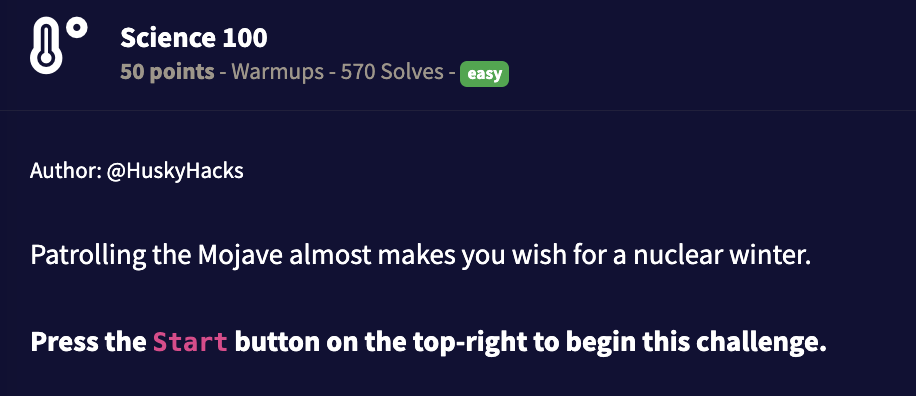

## Writeup



Following the `nc challenge.ctf.games <port>` we get an old Fallout terminal.

```
Welcome to Robco Industries (TM) Termlink

>SET TERMINAL/INQUIRE

RIT-V300

>SET FILE/PROTECTION=OWNER:RWED ACCOUNTS.F
>SET HALT RESTART/MAINT
0xF4F0  ++<_-*-(_@-[  0xF5F0  #/>(#%%_$><<
0xF4FC  $,.^+_([<|^.  0xF5FC  {;>?|}||ARCH
0xF508  )<<>?@/+_):>  0xF608  <-^[|&][{$=]
0xF514  =>?[>:[]}._!  0xF614  &/%)[[{*[}}=
0xF520  }+==*=/SITE)  0xF620  /}//(}@;<![^
0xF52C  -*(&[=:(}]/!  0xF62C  [-]{[=/:^$#%
0xF538  ^COOK,;*?])[  0xF638  ;.[}DIET,{@/
0xF544  =__-},{|}}_]  0xF644  *&,%@@DAMN&;
0xF550  |[$&@%;!)+].  0xF650  ?_<#}{{<^=|=
0xF55C  =)+=),%!$]+)  0xF65C  CLUB^|-?!?:>
0xF568  #{[*>#!MOON(  0xF668  /+/[<=+>@%:,
0xF574  >>;|^@{{>:($  0xF674  ;#){/})/;?&-
0xF580  ?*![^%,*:#.[  0xF680  =^,[*[^:/=_?
0xF58C  (FUEL|[[_&(+  0xF68C  {#<$|$+_&^>[
0xF598  ]*#})=(/-;.)  0xF698  [@&&!*:^/!]@
0xF5A4  =($/)>:[+$[^  0xF6A4  $+$@:)(@/@{.
[!] ATTEMPTS REMAINING: 4
```

You can see at least 8 words the and one of them is the password.

```
[!] ATTEMPTS REMAINING: 4
> ARCH
ENTRY DENIED. LIKENESS: 0/4
[!] ATTEMPTS REMAINING: 3
> DIET
ENTRY DENIED. LIKENESS: 0/4
[!] ATTEMPTS REMAINING: 2
> DAMN
ENTRY DENIED. LIKENESS: 0/4
[!] ATTEMPTS REMAINING: 1
> CLUB

[!] ACCESS GRANTED

Robco Industries Termlink (TM) Mail Protocol Initiated

User: j.hammond@robcoindustries.org

INBOX
1) h.hacks@robcoindustries.org SUBJ: new CTF game idea
2) flag.txt
3) Paella recipe


Select an option (1, 2, or 3): 2

flag.txt
flag{89e575e7272b07a1d33e41e3647b3826}
```
