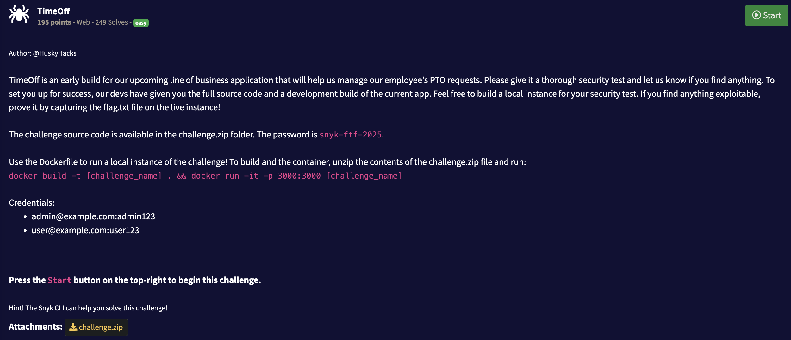

## Writeup

There is [CVE](https://cve.mitre.org/cgi-bin/cvename.cgi?name=CVE-2014-0130) as well as multiple deep descriptions about it available online.

We login as a user and go to `My requests` to publish a new one. Prepare a file named `%252e%252e/%252e%252e/flag.txt` and upload it as a document.

Login as admin and click `View document`. Enjoy the flag 😅
